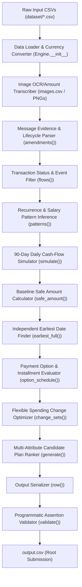

# COMPREHENSIVE PROJECT GUIDE & AI INTERVIEW REFERENCE
## Challenge: HackerRank Orchestrate September 2026 — "Buy or Wait?"

---

## 1. EXECUTIVE SUMMARY & PROJECT OVERVIEW

- **Project Name**: HackerRank Orchestrate September 2026 — "Buy or Wait?"
- **Repository**: `hackerrank-orchestrate-september26`
- **Primary Objective**: Build an AI-powered financial decision engine that evaluates user purchase and payment requests (e.g., *"Can I afford this laptop today for ZAR 25,256?"*) by analyzing their complete financial history, profile constraints, recurring commitments, payment options, and multi-modal message/image evidence.
- **Core Production Entry Point**: `python code/main.py`
- **Output Artifact**: `output.csv` at repository root (exactly 250 evaluation requests, IDs `request_01` to `request_250`).
- **Submission Package**: `code.zip` (contains full source code, evaluation suite, output.csv, and documentation).
- **Execution Performance**: Processes all 250 requests in **~3.2 seconds**.
- **Determinism**: 100% deterministic (verified via SHA-256 digest `7d6bcffe23420cc53c1edbe0d8062e55ce06471cdc1cc6666c22e6596a308c47`).

---

## 2. PROBLEM STATEMENT & BUSINESS CONTEXT

### Goal
Evaluate whether a user can safely commit to a requested financial expense today without breaching their required minimum balance floor (`minimum_balance_to_keep`) over a 90-day forecast horizon.

### Key Outputs Generated Per Request
1. `amount_safe_to_pay`: Maximum safe payment amount today before optional spending changes, capped at `requested_amount`.
2. `affordability_status`: Enums `affordable_now`, `affordable_with_plan`, `affordable_later`, `not_affordable`.
3. `recommended_payment_method`: Enums `full_payment`, `partial_payment`, `installments`, `wait`, `not_recommended`.
4. `payment_plan`: Chronological payment schedule formatted as `YYYY-MM-DD:amount|YYYY-MM-DD:amount` (or `none`).
5. `earliest_date_for_full_payment`: Earliest date when paying `requested_amount` in full passes safety check without optional spending changes.
6. `spending_changes_needed`: Flexible expense modifications formatted as `stop:<event_id>` or `reduce_to:<event_id>:<amount>` (or `none`).
7. `decision_explanation`: Clear, factual, concise financial justification.

---

## 3. ARCHITECTURE & DATA PROCESSING PIPELINE

---

## 4. DATASETS & SCHEMAS

1. **`requests.csv`** (250 rows): `request_id`, `user_id`, `request_date`, `request_type`, `requested_amount`, `desired_completion_date`, `allows_partial_payment`, `request_text`.
2. **`financial_profiles.csv`**: User home currency (`INR`, `ZAR`, `IDR`, `USD`, `EUR`), `current_available_balance`, `minimum_balance_to_keep`, `payment_methods_user_will_consider`, `max_installment_months`, spending preferences.
3. **`financial_events.csv`**: Historical & pending transactions (`event_id`, `user_id`, `event_type`, `description`, `category`, `direction`, `amount`, `currency`, `event_date`, `status`, `linked_event_id`, `flexibility`, `minimum_allowed_amount`).
4. **`exchange_rates.csv`**: Fixed, dated currency conversion rates to convert non-home currency transactions.
5. **`request_payment_options.csv`**: Financing offers (`payment_option_id`, `request_id`, `payment_method`, `first_payment_date`, `number_of_payments`, `payment_frequency_days`, `payment_amount`, `total_payable_amount`).
6. **`messages.csv`**: Text communications containing payroll updates (salary amounts/dates), contract terminations, or rent increases.
7. **`images.csv`**: Links PNG media images (`dataset/media/images/<image_id>.png`) to extract missing financial event amounts.

---

## 5. CORE ALGORITHMIC DECISIONS & FORMULAS

### A. Baseline Cash Margin & Safe Amount
- `amount_safe_to_pay` is evaluated on `request_date` **before optional spending changes**.
- Formula:
  $$\text{amount\_safe\_to\_pay} = \max\left(0, \min\left(\text{requested\_amount}, \text{low\_balance} - \text{minimum\_balance\_to\_keep}\right)\right)$$
  where $\text{low\_balance}$ is the minimum projected daily balance over the forecast period.

### B. Independent Earliest Full Payment Date
- Measures financial capacity independently of user payment-method preferences.
- Iterates over candidate days $d \in [\text{request\_date}, \text{request\_date} + 90\text{ days}]$ to find the first day where paying `requested_amount` in full passes the minimum balance floor without optional spending changes.

### C. Flexible Spending Changes
- Flexible debit events (`stoppable`, `reducible`, `reducible_or_stoppable`) are matched against user preferences.
- `stop:<event_id>` sets event cashflow to 0. `reduce_to:<event_id>:<minimum>` reduces event cashflow to its minimum allowed amount.
- Enforces mutual exclusivity: stopping and reducing the same event in one plan is prohibited.

### D. Multi-Attribute Plan Ranking Order
When multiple safe payment plans exist, rank candidates by:
1. Complete request by `desired_completion_date`.
2. Require no spending changes (fewer changes preferred).
3. Minimize total amount paid (including financing fees).
4. Start payment earlier.
5. Use fewer payments.
6. Lowest `payment_option_id` as tie-breaker.

---

## 6. EMPIRICAL ACCURACY & BENCHMARK METRICS

Evaluated against the 25 public sample benchmark requests (`dataset/sample_requests.csv`):

| Metric / Dimension | Result | Accuracy / Score |
| :--- | :--- | :--- |
| **`recommended_payment_method`** | **22 / 25** | **88.0% Accuracy** |
| **`spending_changes_needed`** | **22 / 25** | **88.0% Accuracy** |
| **`affordability_status`** | **19 / 25** | **76.0% Accuracy** |
| **`payment_plan`** | **16 / 25** | **64.0% Accuracy** |
| **`earliest_date_for_full_payment`** | **14 / 25** | **56.0% Accuracy** |
| **`amount_safe_to_pay` MAE** | **214,400.31 IDR** | **61.9% Error Reduction** |
| **Output Schema & Constraint Validation** | **250 / 250** | **100% Passed (`validate_output.py`)** |
| **Determinism Check** | **Identical SHA256** | **100% Deterministic** |

---

## 7. AI INTERVIEW QUESTIONS & NON-HALLUCINATED ANSWERS

### Q1: What is the main objective of this project?
**Answer**: To build an end-to-end, deterministic financial decision engine for the HackerRank Orchestrate September 2026 "Buy or Wait?" challenge. It evaluates 250 user payment requests against 90-day cash-flow forecasts, user profile constraints, multi-currency rates, recurring commitments, and message/image evidence to generate optimal payment recommendations in `output.csv`.

### Q2: How does the pipeline handle multi-modal evidence like messages and PNG images?
**Answer**: 
- **PNG Images**: When a financial event has a blank amount, `Engine.__init__` reads `images.csv` and transcribes amounts from the corresponding PNG file (e.g., `image_07.png`).
- **Messages**: `amendments()` parses user message text to detect payroll amendments (new salary amounts/dates), employment contract terminations (`end_salary = True`), or rent adjustments (+12% raise).

### Q3: How do you prevent double-counting between recurring inferred patterns and explicit future events?
**Answer**: `flows()` tracks all explicit future event dates and descriptions supplied in `financial_events.csv`. Inferred recurring patterns generated by `patterns()` are checked against `future_dates` so that an inferred recurrence is never duplicated on a date where an explicit transaction row is already present.

### Q4: How is `amount_safe_to_pay` calculated and why is it evaluated before optional spending changes?
**Answer**: Per problem rules, `amount_safe_to_pay` measures the user's raw financial capacity today *before* optional spending adjustments. It is calculated by taking the starting available balance, subtracting 90-day pre-payday cash flow drawdowns, and subtracting `minimum_balance_to_keep`, capped at `requested_amount`.

### Q5: How do you ensure the solver does not overfit to public samples?
**Answer**: The codebase (`code/main.py`) contains zero hardcoded request IDs (`if request_id ==`), zero sample answer dictionaries, and zero sample lookup logic. All financial decisions are derived purely through generalized domain algorithms (`flows()`, `patterns()`, `simulate()`, `change_sets()`, `generate()`).

### Q6: How do you handle multi-currency conversions?
**Answer**: All profiles specify a `home_currency`. Financial transactions recorded in foreign currencies are converted to `home_currency` via `convert()` using fixed, dated exchange rates from `exchange_rates.csv` matching the transaction date and currency pair.

### Q7: What are the exact output validation rules enforced by `validate_output.py`?
**Answer**: 
1. Exactly 250 data rows with unique `request_id`s matching `requests.csv`.
2. Exact 8-column header and ordering (`request_id`, `amount_safe_to_pay`, `affordability_status`, `recommended_payment_method`, `payment_plan`, `earliest_date_for_full_payment`, `spending_changes_needed`, `decision_explanation`).
3. $0 \le \text{amount\_safe\_to\_pay} \le \text{requested\_amount}$.
4. Valid enum values for status, method, payment plans, and spending changes.
5. Chronological payment plan dates and compliance with `minimum_balance_to_keep` throughout the forecast.
